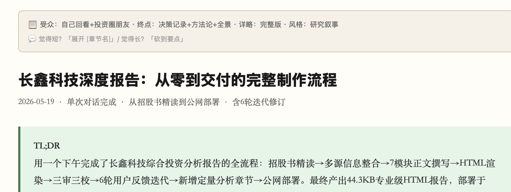
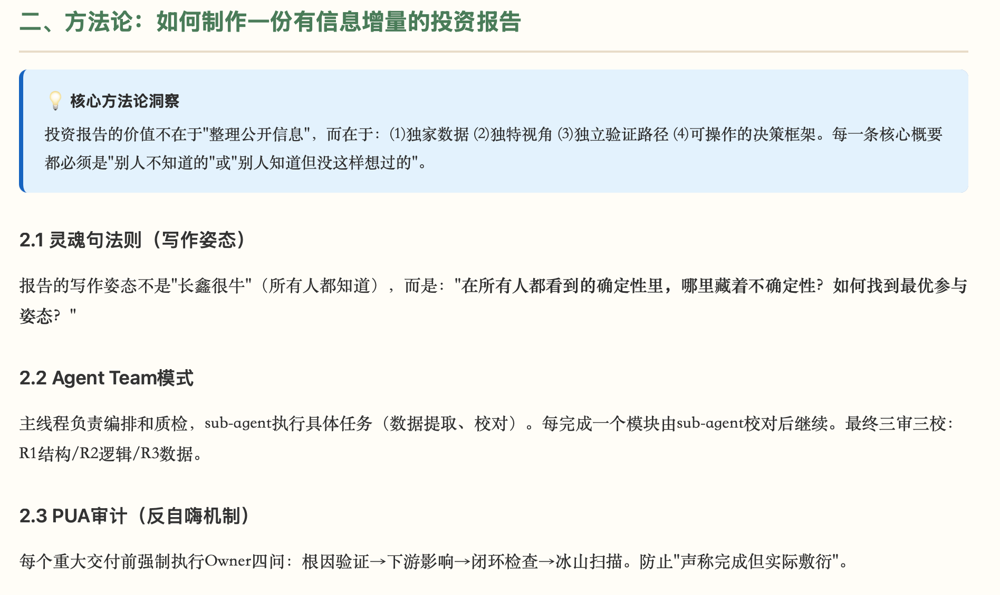
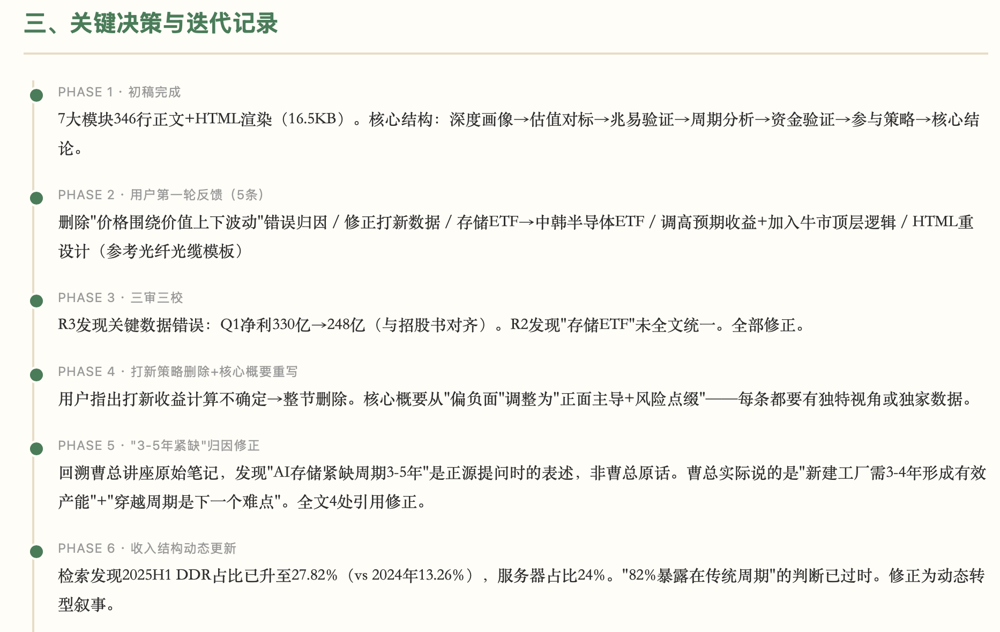
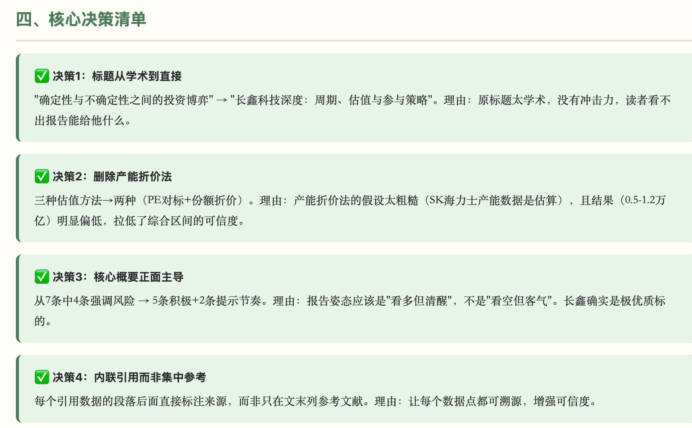
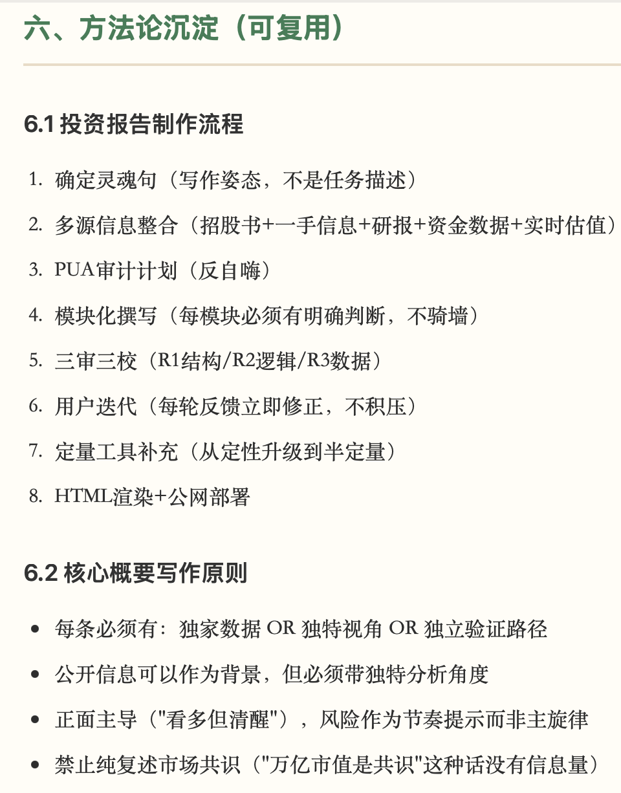

# skill-readable-output

[中文文档](README.md)

---

You just spent two hours with Claude debugging a gnarly race condition. You explored three approaches, killed two, found the root cause in an unexpected place, and landed on a fix that required changing the mental model of how the system works.

Tomorrow you'll remember the fix. In three months, you won't remember why you rejected the other two approaches. You'll re-explore them. You'll waste another afternoon.

**This skill turns that conversation into a self-contained HTML page you can reopen in 5 minutes and be back in the room where it happened.**

Not a transcript. Not a summary. A decision record. What you decided, why, what you rejected, and what's still open.

---

## The Problem It Solves

AI conversations are high-bandwidth but zero-persistence. You discuss, decide, and move on. The chat log is technically there, but nobody re-reads a 200-message thread. The insights rot.

This is worse than not having the conversation at all. Because you think you documented it, "it's in the chat history," so you never write it down properly.

`skill-readable-output` forces the distillation at the moment of maximum context. While you and the AI still remember everything.

## What You Get

A single HTML file. Self-contained, no external dependencies. Opens in any browser. Looks like this:

### Header + TL;DR


### Methodology Insights


### Decision Timeline


### Decision Checklist


### Reusable Methods


## Install

```bash
mkdir -p .claude/skills
curl -o .claude/skills/SKILL-readable-output.md \
  https://raw.githubusercontent.com/git-zyyang/skill-readable-output/main/SKILL-readable-output.md
```

Then, at the end of any valuable conversation:

```text
/readable
```

The skill asks 2-3 questions, generates the HTML, opens it in your browser. 30 seconds to install, one word to trigger.

## 6 Scenarios × 4 Styles

The skill auto-detects what kind of discussion you had and picks the right structure:

| You were discussing | It generates | Looks like |
|--------------------|-------------|-----------|
| Research design | Timeline: explore → reject → select | Warm academic |
| System architecture | ADR: context → decision → consequences | GitHub-style |
| A painful debug | Postmortem: symptom → root cause → fix → prevention | GitHub-style |
| Product direction | Lite PRD: problem → options → tradeoffs → MVP | Card-based |
| Library/framework choice | Weighted comparison matrix | GitHub-style |
| Just the TODOs | Priority-sorted action list | Minimal |

4 visual styles adapt automatically, or you can override:

- **Research Narrative**: warm white, serif, timeline, callout boxes
- **Technical Document**: GitHub aesthetic, monospace code, status badges
- **Product Memo**: cards, tags, progress indicators, priority ribbons
- **Decision Brief**: black and white, nothing but conclusions and reasons

## Why Not Just Ask "Summarize This Conversation"

You can. You'll get a wall of text that's 80% filler. The difference:

| Generic "summarize" | This skill |
|--------------------|-----------|
| Includes everything | Caps at 3 core points, forces prioritization |
| Flat text blob | Structure matches your discussion type |
| No quality control | Half-cut test + 4-question self-check + 11 anti-patterns |
| Disappears in chat | Persists as a file in your project |
| Same format every time | 6 structures × 4 styles, auto-matched |
| No actionability | Extracts concrete TODOs with priorities |
| No boundaries | States where conclusions might break down |

## Built-in Quality Gates

The skill doesn't just write. It audits itself:

- **3-point cap**: More than 3 core insights? Merge or demote. Working memory is a real constraint.
- **Half-cut test**: Keep only half. Which survive? Those are your skeleton.
- **Volume guard**: Chose full version but only had 3 decision points? The skill pushes back.
- **4-question self-check**: Readable without context? Decisions and reasons present? Not a transcript? TODOs actionable?
- **11 anti-patterns**: Transcript-dumping, filler-padding, vague TODOs, missing rationale. All blacklisted.

## Adapt It

**Add a style**: Drop a new CSS `:root` block in the skill file. The HTML skeleton is shared. Only variables change.

**Add a scenario**: Add a row to the structure table. Each scenario needs a name, a structure pattern, and an optional default style.

**Change file paths**: Edit the routing section. Default puts ADRs in `docs/adr_*.html` and discussions in `docs/discussions/`.

**Use with other AI tools**: The skill file is a structured prompt. The phases, templates, and anti-patterns work in any system that accepts custom instructions.

## How It Works

```text
Trigger: "整理一下" / "/readable" / "write an ADR"
    │
    ▼
Phase 1: What scenario? How deep? 2-3 questions, or smart defaults
    │
    ▼
Phase 1.5: Volume self-check. Rejects full version if content is thin
    │
    ▼
Phase 2-4: Define endpoint → Extract ≤3 core points → Pick structure
    │
    ▼
Phase 5: Write. TL;DR → body → TODOs → references → open questions
    │
    ▼
Phase 6: Self-check 4 questions
    │
    ▼
Output: HTML file, auto-opens in browser
```

## When to Skip It

- Chat was under 5 turns. Just write a one-liner.
- Pure code, no decisions. The code is the documentation.
- Already in Jira, Notion, or Linear. Don't duplicate.
- You want markdown. Just say so.
- Discussion isn't over yet. Wait.

## Contributing

PRs welcome. Especially interested in:

- New scenario templates: design sprints, incident response, hiring decisions
- Ports to other AI assistants: GPT, Gemini
- Real output examples for the `examples/` directory
- Translations

## License

[MIT](LICENSE)
